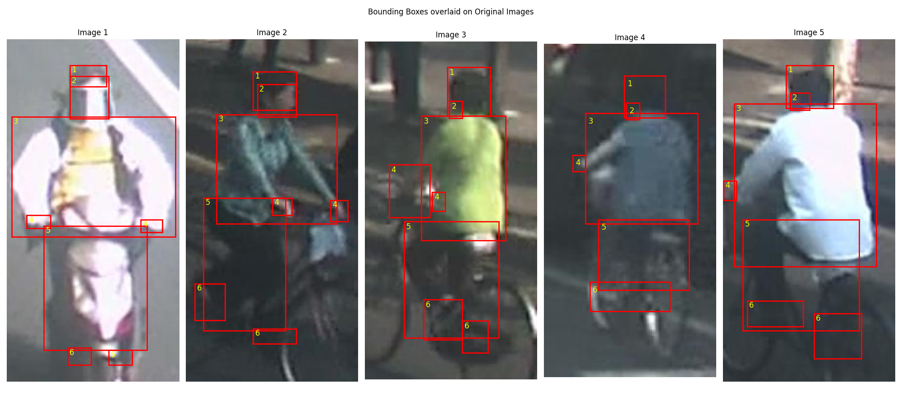

# Computer Vision

## Assignment 1: Hough Transform, Line Segmentation, MLP Classification

<table>
    <tr>
        <td align="center"></td>
        <td align="center"></td>
        <td align="center"></td>
    </tr>
    <tr>
        <td align="center"><a href="a1/q1/q1.ipynb">Cloverleaf Bridge</a></td>
        <td align="center"><a href="a1/q2/q2.ipynb">Historical Document</a></td>
        <td align="center"><a href="a1/q3/q3.ipynb">Fashion-MNIST Dataset</a></td>
    </tr>
</table>

## Assignment 2: ResNet18 Classification, Network Visualization, Style Transfer

<table>
    <tr>
        <td align="center"></td>
        <td align="center"></td>
        <td align="center"></td>
    </tr>
    <tr>
        <td align="center"><a href="a2/q1/q1.ipynb">CIFAR-10 Dataset</a></td>
        <td align="center"><a href="a2/q2/q2.ipynb">Saliency Map</a></td>
        <td align="center"><a href="a2/q3/q3.ipynb">Style Transfer</a></td>
    </tr>
</table>

## Assignment 3: Faster R-CNN - Axis Aligned and Oriented Bounding Box Detection

<table>
    <tr>
        <td align="center"></td>
        <td align="center"></td>
        <td align="center"></td>
    </tr>
    <tr>
        <td align="center"><a href="a3/q1b/README.md">Scene Text Detection</a></td>
        <td align="center"><a href="a3/q2/README.md">Fruit Detection</a></td>
        <td align="center"><a href="a3/q3/README.md">Human Part Detection</a></td>
    </tr>
</table>

## Assignment 4: Semantic Segmentation - Fully Convolutional Networks and U-Net

<table>
    <tr>
        <td align="center"></td>
        <td align="center"></td>
    </tr>
    <tr>
        <td align="center"><a href="a4/q1/README.md">FCN-8s</a></td>
        <td align="center"><a href="a4/q2/README.md">Residual U-Net</a></td>
    </tr>
</table>

## Assignment 5: Vision Transformer, Differential Transformer, CLIP Zero-Shot Classification

<table>
    <tr>
        <td align="center"></td>
        <td align="center"></td>
        <td align="center"></td>
    </tr>
    <tr>
        <td align="center"><a href="a5/q1/README.md">Attention Rollout</a></td>
        <td align="center"><a href="a5/q2/README.md">Layerwise Attention</a></td>
        <td align="center"><a href="a5/q3/README.md">ImageNet Dataset</a></td>
    </tr>
</table>
