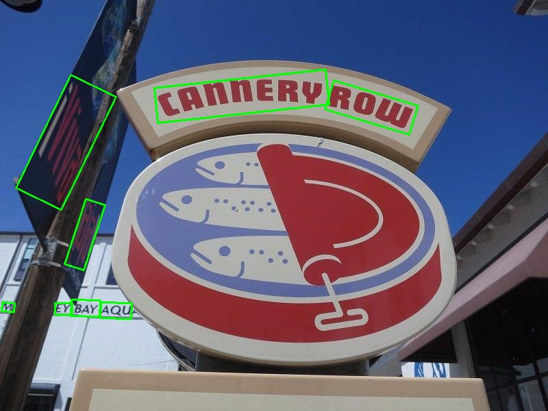
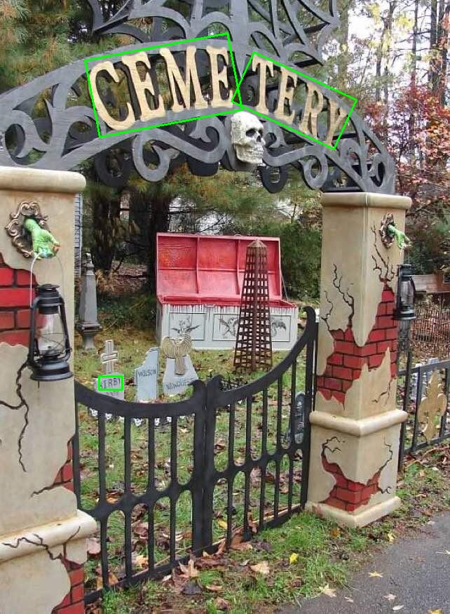

# Oriented Bounding Boxes through Faster RCNN

## Data Visualization

## Understanding Faster RCNN

Relevant animations can be found in the ``visualization`` folder (TODO: Upload and add link).

File Naming Convention: ``{visualization_type}_{image_index}_{hyperparameter_index}.png``

Hyperparameters and their indices:
1. Base configuration: [base.yaml](./config/base.yaml)
2. Try more aspect ratios: [aspect.yaml](./config/aspect.yaml)
3. Retain less proposals: [aspect.yaml](./config/aspect.yaml)
