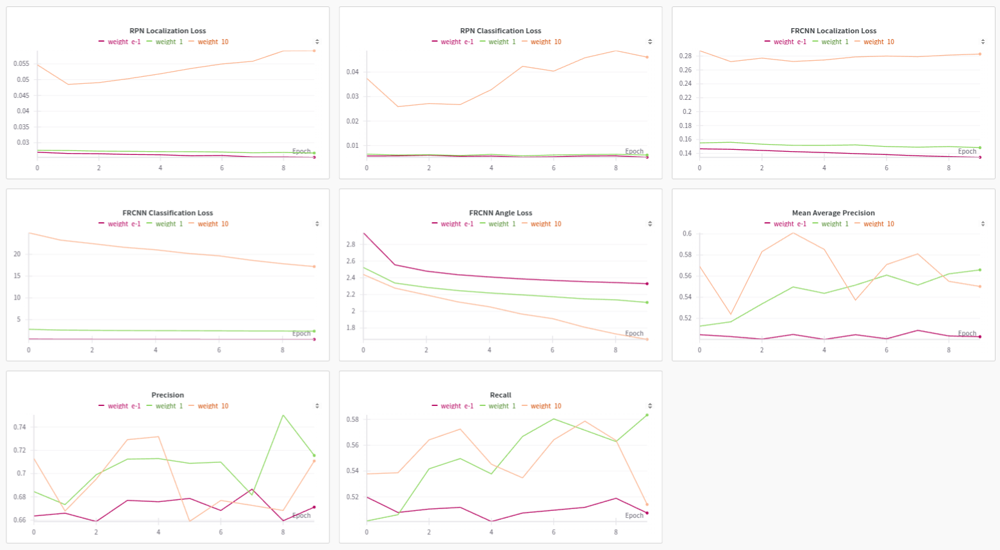
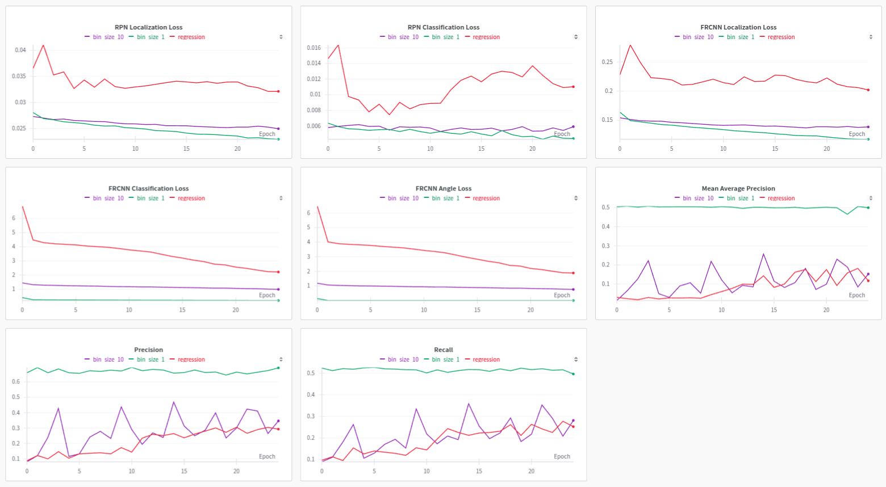
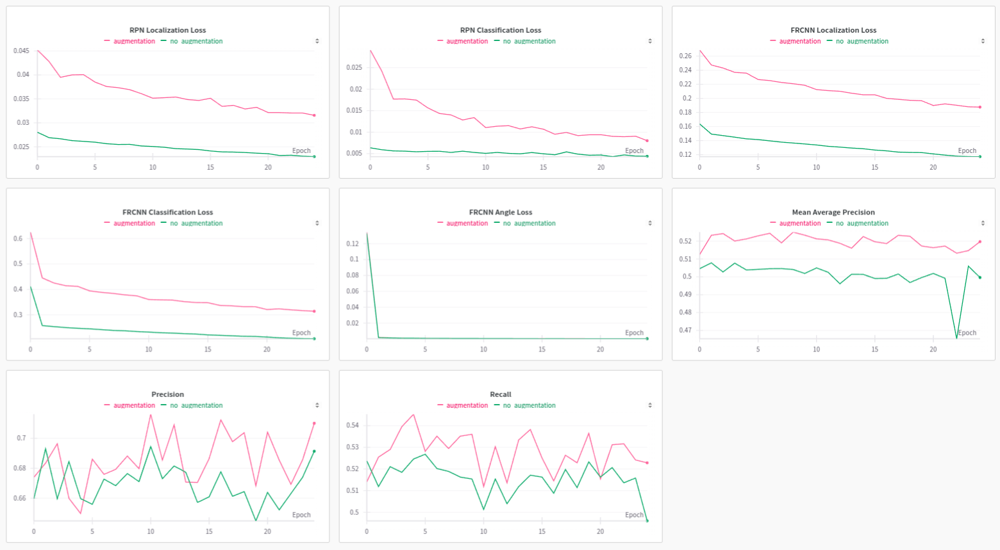
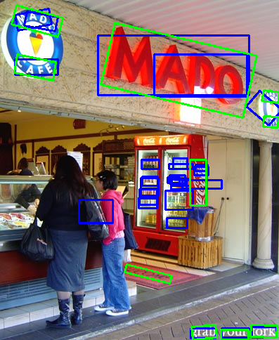
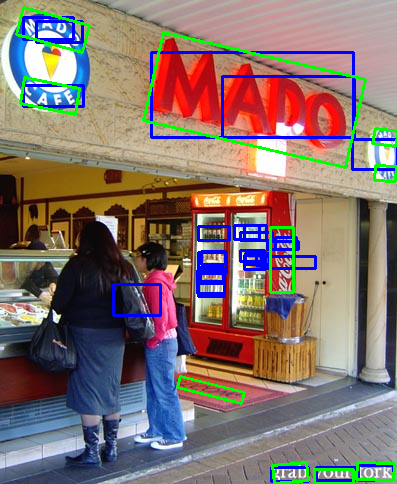
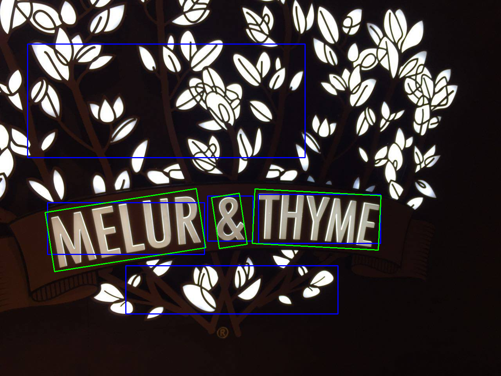
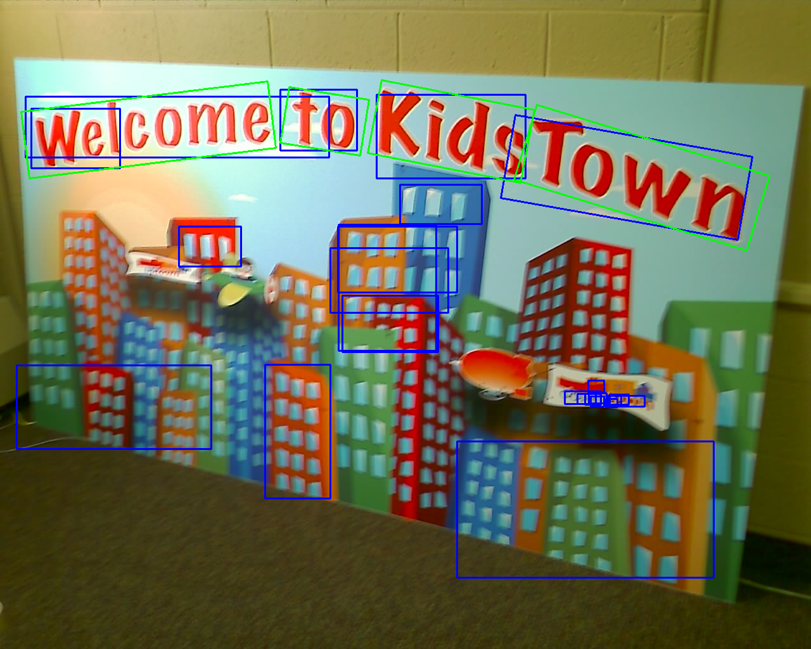
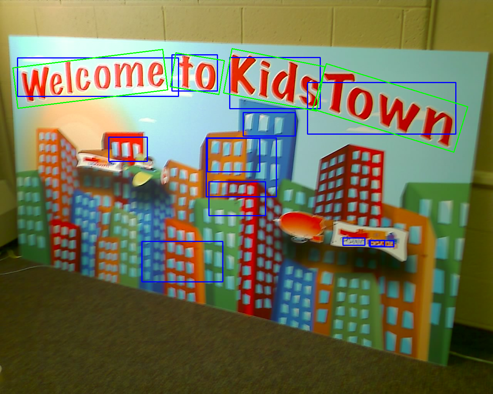
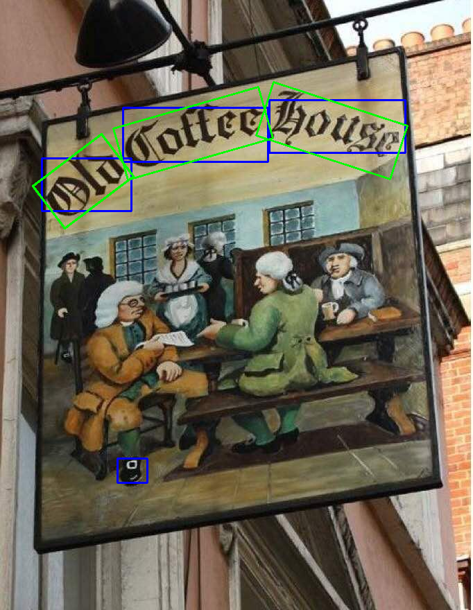

# Oriented Bounding Boxes through Faster RCNN

## Extending Faster R-CNN for Oriented Bounding Boxes

### Hyperparameter Tuning

#### Loss Weights

#### Bin Sizes

#### Augmentation

### Analysis

#### Metrics

| Name          | Precision@0.50 | Recall@0.50 | mAP@0.50 | mAP@0.55 | mAP@0.60 | mAP@0.65 | mAP@0.70 | mAP@0.75 | mAP@0.80 | mAP@0.85 | mAP@0.90 |
|---------------|----------------|-------------|----------|----------|----------|----------|----------|----------|----------|----------|----------|
| augmentation  | 0.71           | 0.52        | 0.52     | 0.45     | 0.41     | 0.34     | 0.27     | 0.20     | 0.13     | 0.03     | 0.02     |
| bin_size_10   | 0.35           | 0.28        | 0.15     | 0.12     | 0.11     | 0.09     | 0.07     | 0.05     | 0.03     | 0.02     | 0.00     |
| bin_size_1    | 0.69           | 0.50        | 0.50     | 0.44     | 0.37     | 0.33     | 0.26     | 0.16     | 0.10     | 0.05     | 0.02     |
| regression    | 0.29           | 0.25        | 0.12     | 0.08     | 0.04     | 0.03     | 0.01     | 0.01     | 0.01     | 0.00     | 0.00     |
| weight_e-1    | 0.67           | 0.51        | 0.50     | 0.44     | 0.36     | 0.29     | 0.23     | 0.11     | 0.05     | 0.02     | 0.00     |
| weight_1      | 0.72           | 0.58        | 0.57     | 0.54     | 0.47     | 0.38     | 0.32     | 0.20     | 0.13     | 0.09     | 0.02     |
| weight_10     | 0.71           | 0.51        | 0.55     | 0.50     | 0.44     | 0.35     | 0.26     | 0.18     | 0.11     | 0.02     | 0.00     |

#### Visualization

Two types of models were broadly noticed in bounding box visualization. One class predicting images like the ones given in left (e.g. models with larger bin sizes, regression output, higher angle loss weight) and others collapsing to zero angle trivial solutions like the ones in right.

#### Analysis

- **Failures:**

    i. The model's prediction capability seems to be limited to orientations close to horizontal axis aligned box. This could be attributed to the initialization of weights and the axis aligned proposal.

    ii. The model seems to be struggling with text recognition task. For example, it may be confusing between the circular artifact in the shoe of the fourth image and the letter 'o'. This is a serious concern since, letters can still look like letters even when viewed at a different angle, but their semantics would change. An auxillary text recognition task may help improve the situation.

    iii. There are two other concerns here: First, often the orientations are not every evident from the texts, it becomes clear only with the context (see the top left of the first image for example). Second, in classification, we are penalising the angles based on cross entropy which assumes that each bin is independent. This discourages the model to learn a closer approximation - which it should ideally in an iterative learning procedure.

- **Candidate changes for improvement:**

    i. The representation length (i.e. the length of the input vector fed to the final predictor module) can be increased. It is currently set to 1024, which may be insufficient for predicting an extra angle output.

    ii. Random rotation can be used to generate more uniform samples of bounding box angles in the [0, 180] range. This would require addressing issues like boxes being clipped off.

    iii. A diversity loss can be added (works even better in conjunction with ii.) to encourage the model to learn different possible angles, and avoid output collapse.

    iv. Possibilities with the architecture include passing the features of neighbourhood of the anchors (say via skip connection), so that the model gets more perspective on the orientation; generating oriented proposals (scaling might be an issue here - however note that aspect ratios and angles are not independent of each other).

- **Convergence behavior and challenges:**

    i. Apart from the aspects mentioned earlier (representation length, fundamental assumption with classification, etc.), there seems to be a tradeoff between improving the three FRCNN losses (excluding RPN). This likely prohibits the convergence we would otherwise achieve in each of these prediction tasks.

    ii. Regression performance was clearly poor. An extra regression term could be added to learn an offset to the mean of the classification bin.
