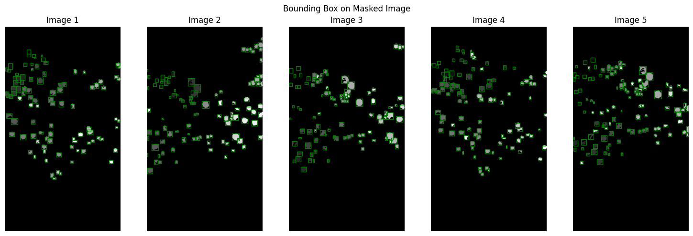
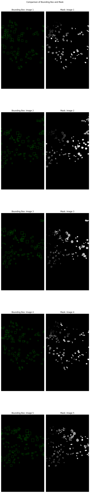
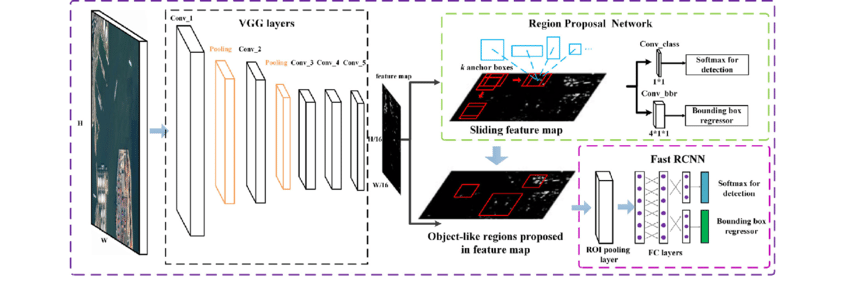
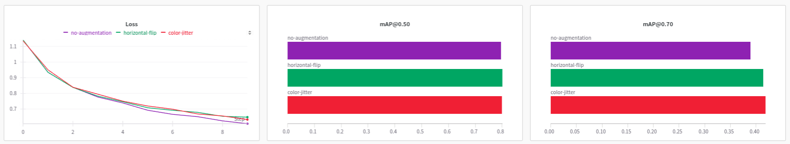
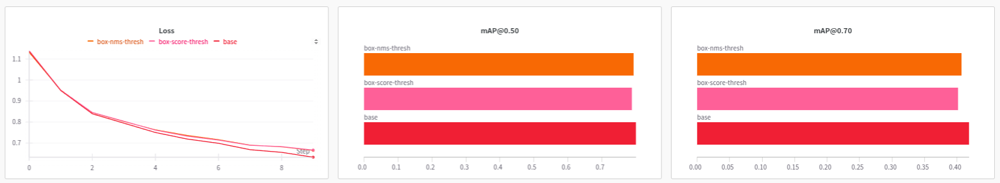

# Fruit Detection and Counting

## Dataset Preprocessing and Visualization

## Dataset and Model Implementation

- The code from torchvision for FasterRCNN was reused, with two major changes. The ResNet50 backbone was replaced with ResNet34. The set of anchor sizes was reduced from ``(32, 64, 128, 256, 512)`` to ``(32, 64, 128)``. The latter was due to the objects of concern being small in size and plentiful in the images. The number of classes was set to two, similar to the previous question.

- The architecture diagram for Faster RCNN is as follows ([source](https://www.researchgate.net/figure/The-architecture-of-Faster-R-CNN_fig2_324903264)). The modifications made concern themselves with the backbone (denoted as VGG layers block in the figure), anchor boxes (given in the Region Proposal Network block in the figure), and the classification layer (given as "Softmax for detection" in the figure).

## Detection Analysis

- **Anchor Box Configurations:** Discussed earlier.

- **Non-Maximum Suppression and Overlapping Fruits:** Since the dataset consists of many small fruits close to each other, it has to be ensured that the NMS threshold is set high enough that boxes corresponding to different fruits are not suppressed. Another strategy for improving detection of overlapping fruits is to tune the confidence thresholds to sample sufficient boxes in close neighborhood.

- **IoU Thresholds:** The concern with intersection and union here is two fold. Both the ground truth boxes and the predicted boxes can be very close to each other and inprecise about their length and breadth due to assumption about the anchor sizes. Besides, the general trend is that for a higher threshold less number of predicted boxes are mapped to ground truth boxes, reducing the recall. To the contrary, lower threshold can increasing the recall but reduce the precision. Balancing both precision and recall is essential for getting a good mAP (computed as area under the precision recall curve). 

## Training

### Data Augmentation

### Confidence Thresholds

Two changes in confidence thresholds were tried independently: increasing ``box_score_thresh`` from 0.05 to 0.3 and reducing ``box_nms_thresh`` from 0.5 to 0.3. Both aimed at reducing the number of false positives.

### Image Resolution

- Model performance for different image resolution was not tested. However, it is not difficult to see that a smaller resolution would not work for the given dataset. There are images with around 100 bounding boxes, many of them having a very small length. Any attempt to resize or downsample would lead to loss of information.

- Something similar to the previous assignment can be done here. We can remove one of the initial downsampling layers of the backbone to better preseve the information of smaller objects in the image.

## Evaluation

- The mAP, False Positive and False Negative are summarized in the following table.

| Model, Threshold   | (FN, FP, mAP) 0.50 | (FN, FP, mAP) 0.60 | (FN, FP, mAP) @0.70 | (FN, FP, mAP) @0.80 | (FN, FP, mAP) @0.90 |
|--------------------|-------------------|-------------------|-------------------|-------------------|-------------------|
| box-nms-thresh     | 905, 3900, 0.79   | 1639, 4634, 0.64  | 2728, 5723, 0.41  | 4260, 7255, 0.12  | 5404, 8399, 0.00  |
| box-score-thresh   | 921, 2776, 0.79   | 1588, 3443, 0.64  | 2731, 4586, 0.40  | 4300, 6155, 0.11  | 5428, 7283, 0.00  |
| no-augmentation    | 829, 5811, 0.80   | 1493, 6475, 0.66  | 2770, 7752, 0.39  | 4241, 9223, 0.13  | 5375, 10357, 0.00 |
| horizontal-flip    | 805, 5991, 0.80   | 1500, 6686, 0.65  | 2692, 7878, 0.41  | 4190, 9376, 0.14  | 5368, 10554, 0.00 |
| color-jitter       | 833, 5595, 0.80   | 1489, 6251, 0.66  | 2650, 7412, 0.42  | 4195, 8957, 0.14  | 5401, 10163, 0.00 |

## Analysis

- The dominant issue here is the presence of too many False Positives. This is partially addressed by changing the confidence thresholds. Changing both simultaneously may give an even better result.

- Higher recall may be desirable in real life scenarios where you don't want to ignore any fruit. For a counting task however, both precision and recall have equal importance.

- Effect of occlusion, color and lighting variation and scales remains to be seen. This would require grouping images based on these conditions and conducting independent evaluation of each set.

- The effect of density should be easier to test against as the density can be computed easily be counting the number of ground truth boxes in any given region.

## Potential Modifications

- **Detecting fruit types:** This can be accomodated by adding fruit type labels to the dataset and changing the classification head. Color jitter will have to be removed or constrained to avoid confusion between two fruits.

- **Improving robustness to environmental variations:** Random application of lighting and shadow filters (e.g. presets offered in mobile phones and social media apps) can be explored.

- **Handling different growth stages and ripeness levels:** There are datasets for growth stages of certain crops. The existence of particular fruits remains to be seen. Depending on the annotation available, an additional classification or regression task can be added similar to angle detection in the first question.
