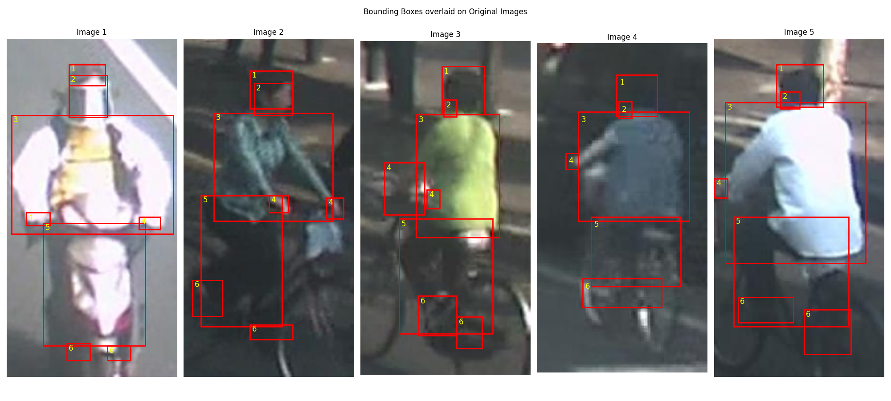
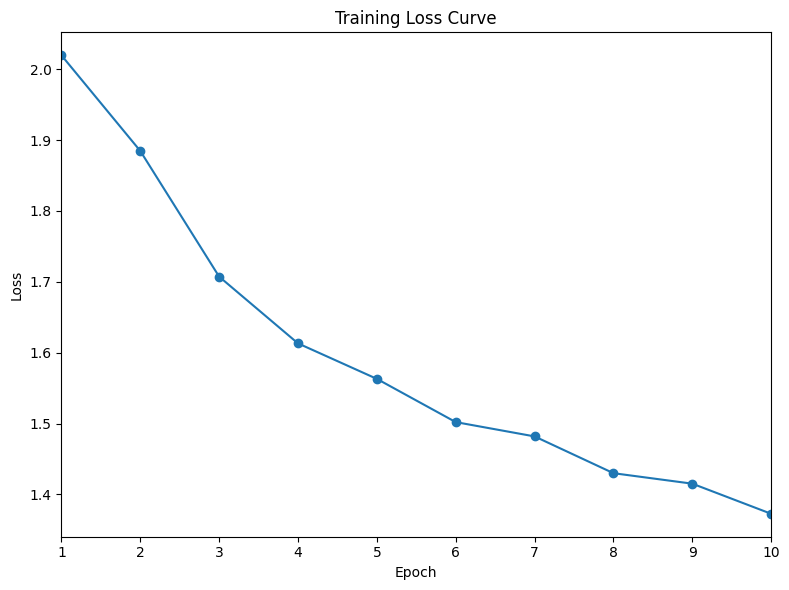

# Human Parts Detection

## Dataset Processing

- The segmentation mask follows a fixed color code (given below). A part specific binary mask can be created using the equality operator. Contours and corresponding bounding boxes can be found for each connected component in the mask using OpenCV, or manually using image processing techniques (e.g. connected component followed by iterately finding the {min, max} {x, y} values for each (x, y) in the component).

```python
(  0,   0, 143): 0,     # Background
(  0,  32, 255): 1,     # Hair
(  0, 191, 255): 2,     # Face
( 96, 255, 159): 3,     # Torso
(255,  80,   0): 4,     # Hands
(255, 255,   0): 5,     # Legs
(143,   0,   0): 6      # Feet
```

- A list of annotations was then created, where each annotation corresponds to an image. The annotations consist of the image paths, and coordinates and labels for the bounding boxes present in the images.

- The dataset was then split into train and validation sets using an 80-20 ratio.

## Exploratory Data Analysis

- A challenge that is easy to see in the visualization is that many body parts are not clearly visible in the low resolution images. Yet they are covered in the segmentation masks and are visible in the bounding boxes. This may force the model to overfit into several assumptions, e.g. feet lying exactly below the torso (which may not be always true depending on the position assumed by human).



- The distribution of bounding boxes for different parts is as follows.

| Part | Count | Length (Range, Mean, Std) | Aspect Ratio (Range, Mean, Std) | Center (Range, Mean, Std) |
|---|---|---|---|---|
| Hair | 4012 | [1.4, 370.0], 42.2, 19.0 | [0.3, 6.0], 1.1, 0.3 | [(24.4, 9.9), (331.9, 493.4)], (89.5, 45.8), (29.4, 17.4) |
| Face | 3131 | [1.4, 164.1], 31.7, 15.2 | [0.1, 6.5], 1.0, 0.4 | [(0.8, 17.1), (371.7, 223.8)], (89.7, 61.8), (31.0, 21.0) |
| Torso | 4159 | [1.4, 346.9], 107.5, 46.6 | [0.1, 8.9], 0.9, 0.3 | [(0.7, 1.1), (347.8, 535.7)], (91.4, 129.5), (30.4, 44.5) |
| Hands | 5924 | [1.4, 234.8], 29.2, 21.2 | [0.1, 9.0], 0.9, 0.5 | [(0.7, 25.5), (329.5, 528.3)], (89.8, 160.4), (53.3, 60.8) |
| Legs | 4076 | [1.9, 410.0], 108.3, 52.6 | [0.2, 3.0], 0.6, 0.3 | [(12.8, 90.3), (282.0, 603.5)], (92.5, 244.9), (30.4, 77.5) |
| Feet | 6986 | [1.4, 197.0], 27.6, 15.6 | [0.2, 7.1], 1.5, 0.7 | [(0.7, 0.8), (336.0, 762.5)], (93.4, 310.9), (45.3, 101.4) |

- It can be observed that while there the range of values assumed by the length and aspect ratio of the bounding boxes are pretty large, the standard deviation is not very significant. We also see a clear monotonic trend in the average position of the body parts, in line with our intuition.

## Model Selection and Implementation

- Faster RCNN was used for two reasons. First, they tend to give more precise results, than the single stage models. Second, due to familiarity with its working, implementation and hyperparameters (from the previous questions). This should help in reducing time for development and reasonable convergence.

- Modifications were made to anchor boxes in line with the data exploration. A wider range of aspect ratio was chosen - ``[0.25, 0.5, 1.0, 2.0, 4.0]``, besides a smaller range for size - ``[32, 64, 128]``.

- The data augmentation strategies used were: color jitter, ImageNet normalization and random horizontal flips.

## Training

- The training configuration was mostly borrowed from the earlier tasks. Small changes were made to account for the appropriate bounding boxes.

- The resource utilization was as follows. A RTX 2080 Ti was used for this task. Training and inference took around 3 and 0.5 mins/epoch respectively. The memory requirement was around 4.5GB.

- The loss curve was as follows.



## Evaluation

The metrics for the validation set were as follows.

| Class, Threshold | (AP, Precision, Recall) 0.50 | (AP, Precision, Recall) 0.70 | (AP, Precision, Recall) 0.90 |
|-------|-------------------|-------------------|-------------------|
| Hair  | 0.37, 0.64, 0.42  | 0.36, 0.64, 0.41  | 0.02, 0.14, 0.09  |
| Face  | 0.26, 0.64, 0.31  | 0.24, 0.65, 0.28  | 0.00, 0.07, 0.02  |
| Torso | 0.50, 0.61, 0.62  | 0.49, 0.62, 0.60  | 0.22, 0.42, 0.36  |
| Hands | 0.21, 0.68, 0.25  | 0.07, 0.36, 0.13  | 0.00, 0.03, 0.01  |
| Legs  | 0.47, 0.58, 0.58  | 0.46, 0.58, 0.55  | 0.09, 0.26, 0.20  |
| Feet  | 0.13, 0.74, 0.14  | 0.03, 0.35, 0.07  | 0.00, 0.03, 0.00  |

## Analysis

- The recall was very poor for feet which was anticipated earlier due to the poor quality and resolution of the images. The same is true to some extent for face and hands.

- The precision for each part is similar which is both a good because it shows robustness and lack of imbalance, and bad because it leaves no easy clue to improve detection.

- The drop in AP for hands and feet is the most abrupt, possibly due to small size and very less of scope of error in getting a good intersection.

- The impact of viewpoint variation remains to be seen. This would require grouping objects based on their viewpoint and conducting independent evaluation of each set.

## Potential Improvements

- The main challenge here seems to be the poor resolution and quality of images. Removing some downsampling layers like the previous assignment may help.

- Various techniques for upsampling may be explored to get more refined images, while at the same time not disrupting the segmented masks.

- A simpler architecture that predicts one class per anchor, rather than evaluating thousands of proposals would be more appropriate for this task.

- Part relationship may be explored using techniques similar to the one discussed in class for bike rider detection. However in that environment, existence of a bike and person can be independent.

- We can try models for detecting the entire human body, and then try to segment parts in the narrowed down subpart. This can make it a lot easier because we can expect the feet (say) to always be in selected regions of a person's bounding box.
