# Fully Convolutional Networks for Semantic Segmentation

## Dataset Visualization

Listed are some random image samples from the train set and corresponding binary masks.

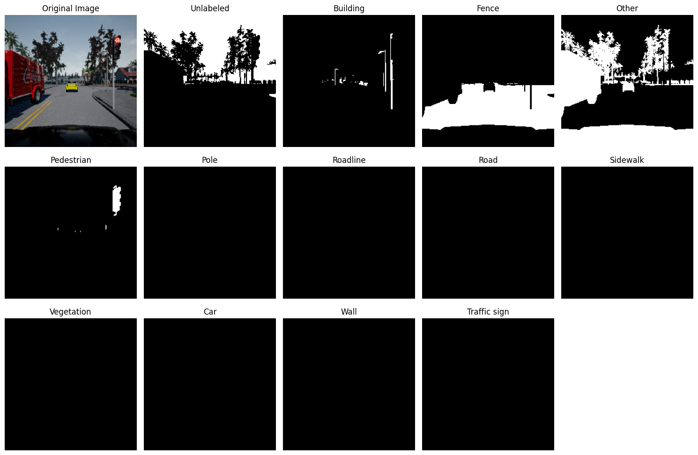

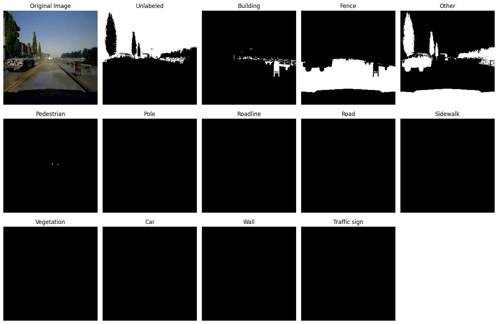

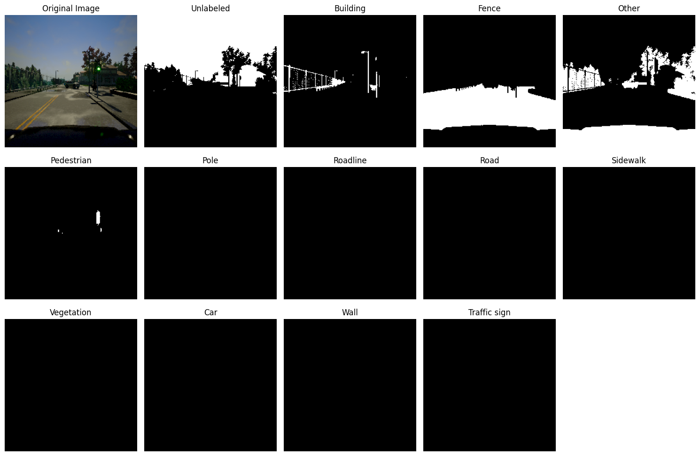

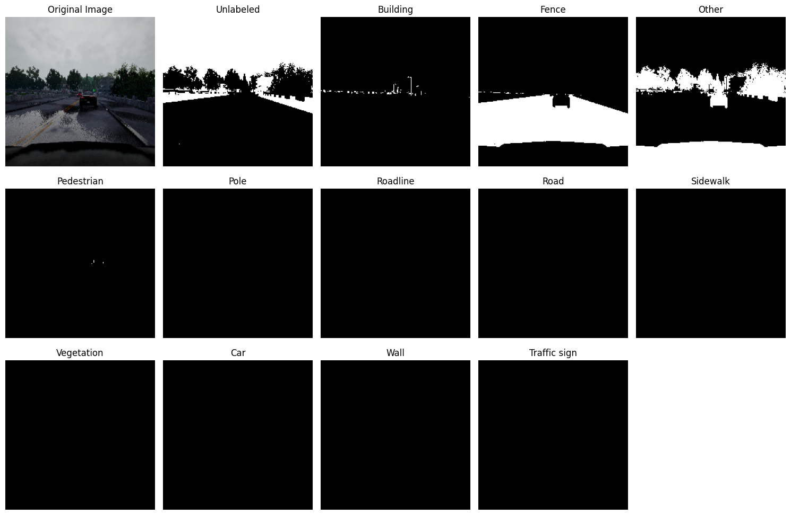

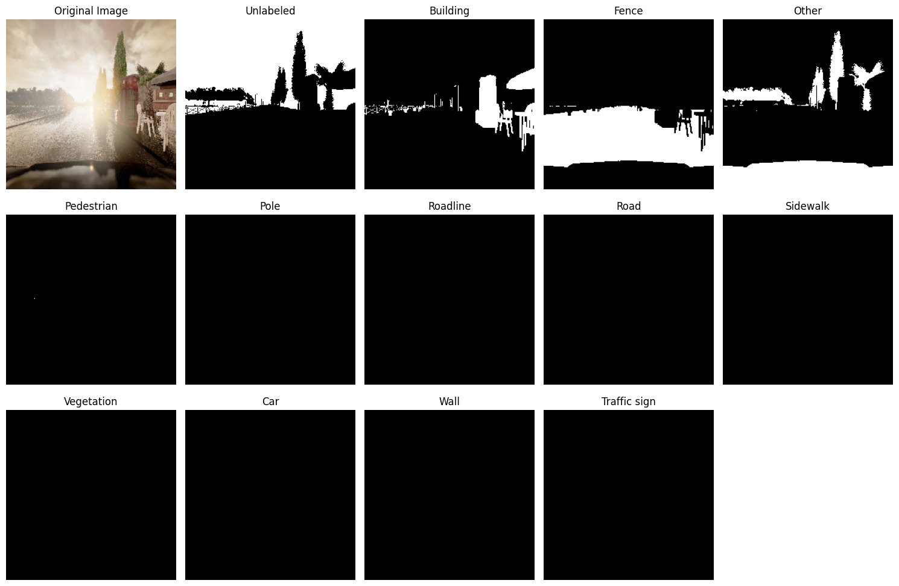

## Quantitative Analysis

The plots for loss and metric curves are as follows.

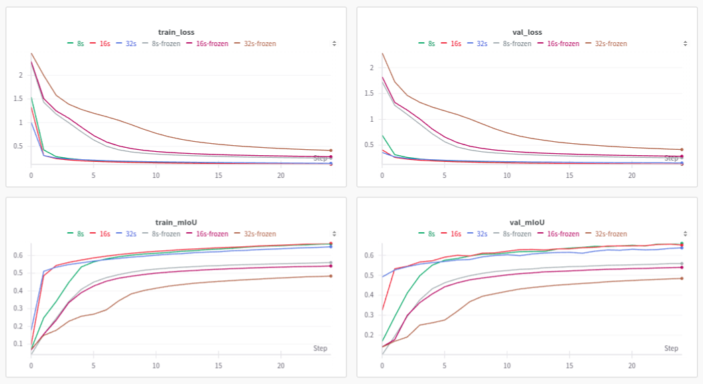

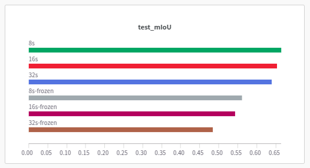

**Observations:**

- Performance and convergence rate was poor when backbone weights were frozen.

- Same holds true for models with less number of upsampling stages (e.g. FCN-32s).

## Qualitative Analysis

### Frozen Backbone

#### FCN-32s

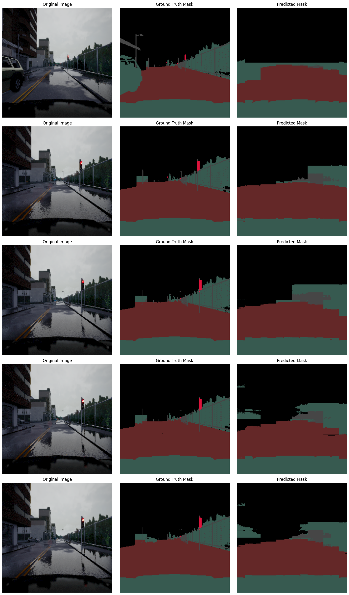

#### FCN-16s

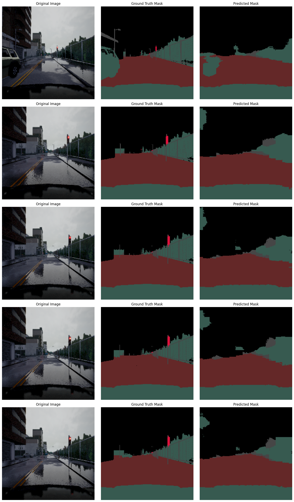

#### FCN-8s

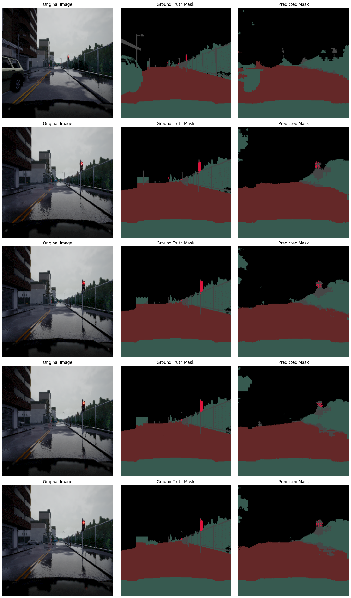

**Observations:**

- We notice that more number of upsampling stages, that can utilize information from different pooling layers, help in better segmentation of finer details (e.g. the traffic light).

### Trainable Backbone

#### FCN-32s

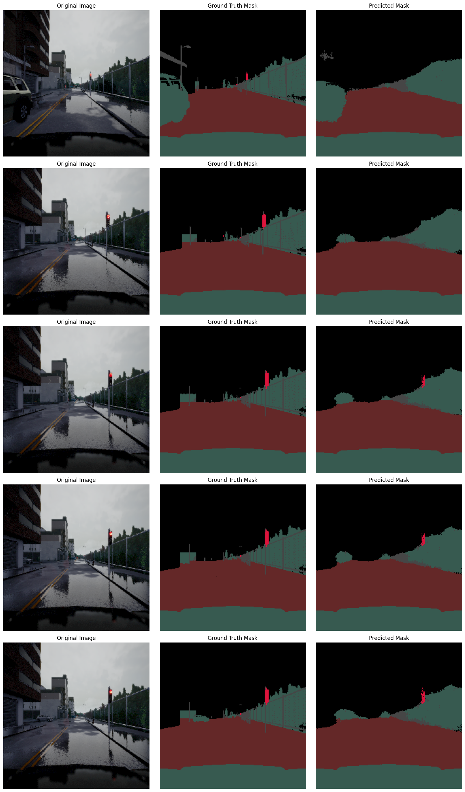

#### FCN-16s

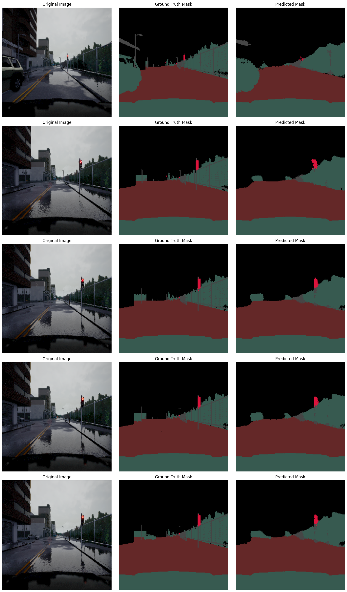

#### FCN-8s

**Observations:**

- We notice that finetuning the backbone helps capture more details (e.g. the car, the fence, etc.), which otherwise may not be prominent in the representation learned by the pretrained backbone.
