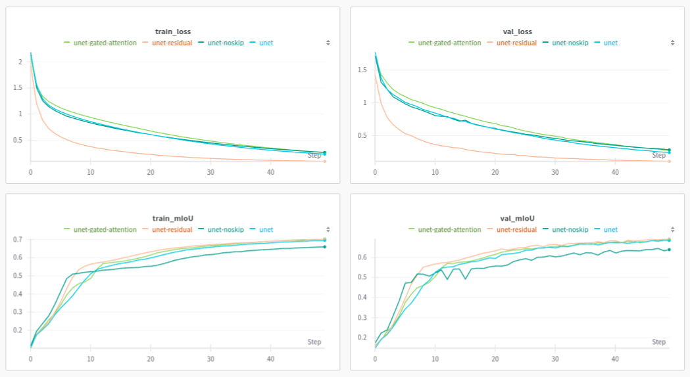
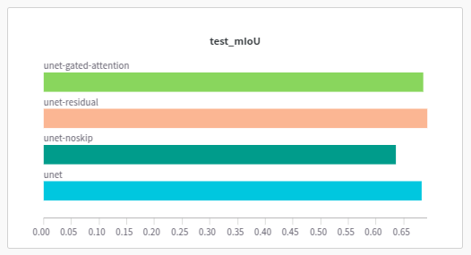
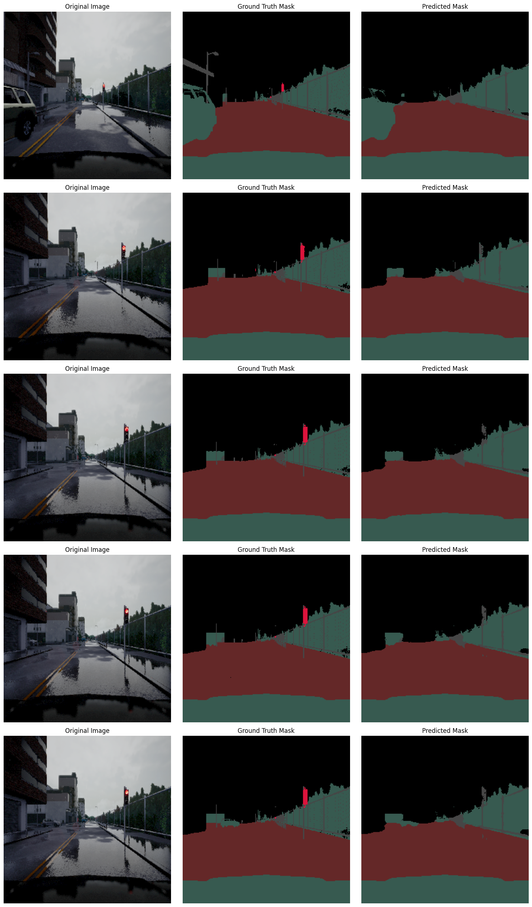
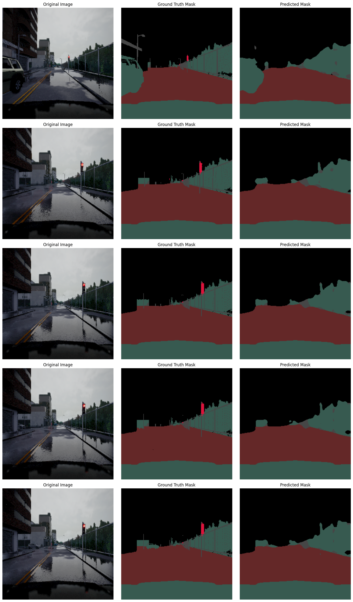
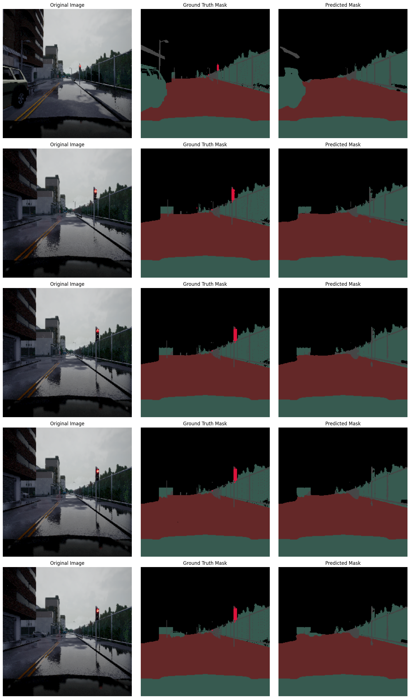

# Semantic Segmentation using U-Net

## Quantitative Analysis

The plots for loss and metric curves are as follows.

**Observations:**

- Removal of skip connection and addition of gated attention did not have a significant impact on the loss curve. However, there was a visible drop in mIoU upon removal skip connections.

- The model with residual connection converged much faster, which was expected given we are dealing with deep models that are known for gradient issues.

- Residual U-Net achieved a significantly low loss value. However, this did not lead to much improvement in the mIoU.

## Qualitative Analysis

### Vanilla U-Net

### U-Net without skip connections

### Residual U-Net

### Gated Attention U-Net

**Observations:**

- U-Net without skip connections misses the finer details (e.g. the traffic signal) altogether. This explains a drop of ~0.05 in mIoU.

- The segmentation maps generated by Residual U-Net and Gated Attention U-Net, besides acknowledging the smaller artifacts, preserve geometry better than Vanilla U-Net. For instance, consider the five variants of the green rectangle in the center-left of the ground truth and the predicted mask.

## Theoretical Questions

**Qn. Discuss the importance of skip connections in U-Net. Explain their role in U-Net’s performance.**

- Skip connections provide a way to use higher resolution features in generating segmentation maps, which otherwise would be lost due to downsampling and the bottleneck lower dimensional embedding.

- Multiple skip connections also help fuse features learned at different scales.

- Besides preserving information, it also helps deal with the vanishing gradient problem by providing a more direct path for gradient flow, akin to the residual networks.

**Qn. What are some advantages of using Attention gates as per the paper? How does gating signal at skip connections help in improved performance?**

- They allow to "disambiguate irrelevant and noisy responses in skip connections". Besides, it could help in discarding redundant information which has been preserved after downsampling, and focus more on the lost information.

- They help to "reduce false-positive predictions for small objects that show large shape variability". Earlier methods had to "rely on additional preceding object localisation models".

- They filter the "the neuron activations during the forward pass as well as during the backward pass ... This allows model parameters in shallower layers to be updated mostly
based on spatial regions that are relevant to a given task".
