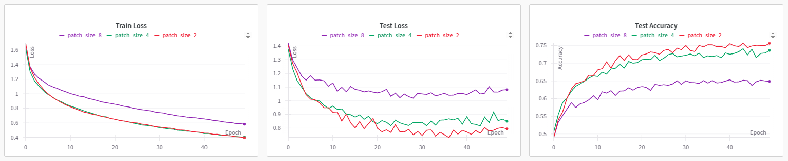
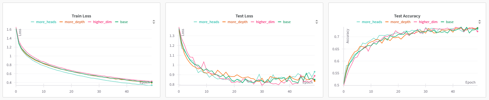
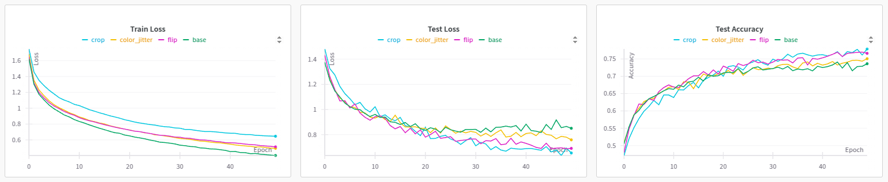
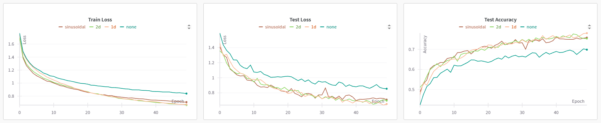
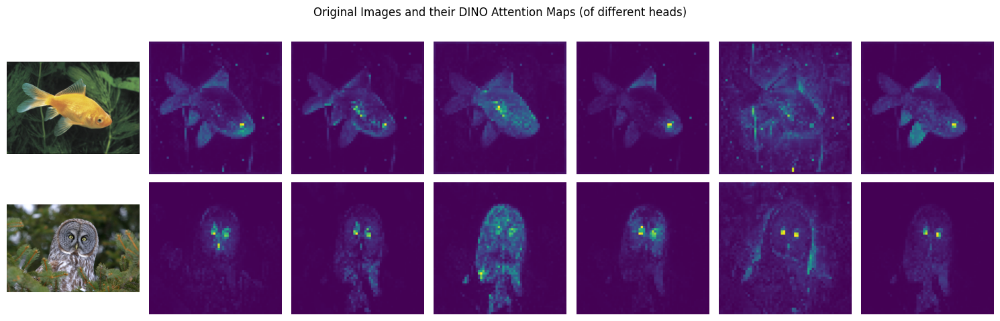
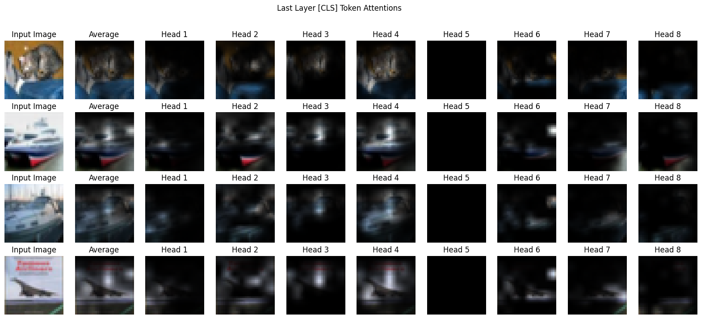
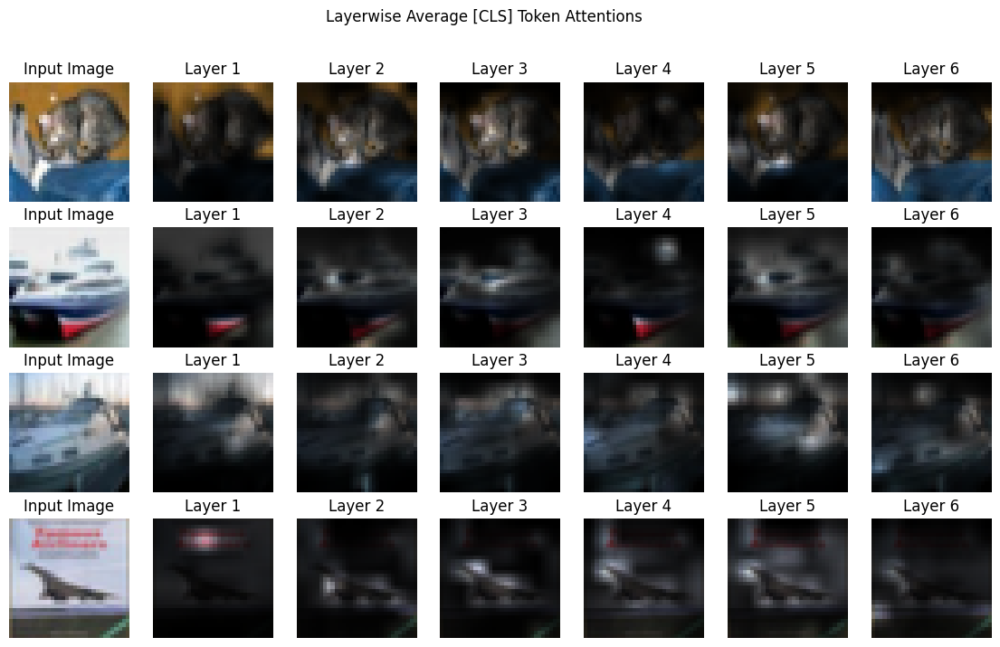
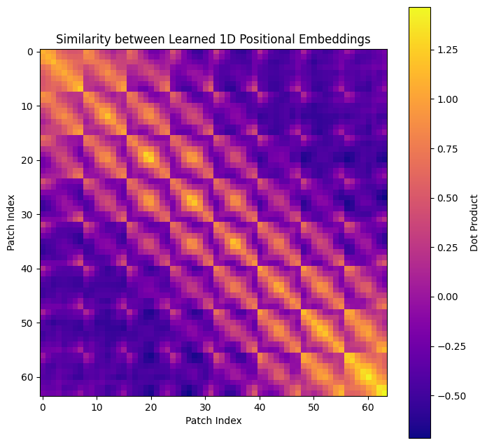

# Vision Transformer

## Training

### Patch Size

Patch size of 2 worked the best, closely followed by patch size of 4. We will however use the latter for subsequent experiments, since the former can be four times slower to train.

### Hyperparameter

Increasing the number of parameters, e.g. depth, representation length, etc. led to no significant improvement in performance compared to the default ones.

### Data Augmentation

Random horizontal flip and random crop led to considerable improvement in test performance, unlike color jitter. 

### Positional Embedding

All the three positional embeddings had similar results and outperformed the absence of positional embedding.

## Visualization

### DINO Attention Maps

### ViT CIFAR-10 Attention Maps

### Attention Rollout

### Positional Embedding

