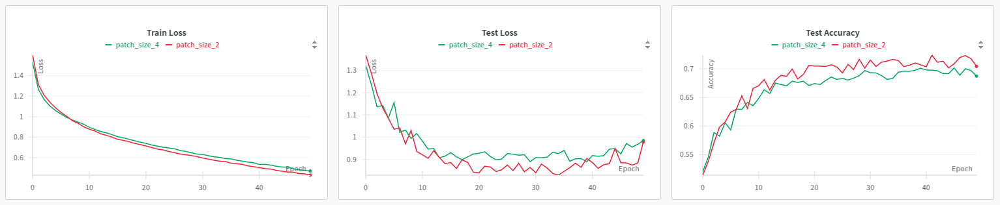
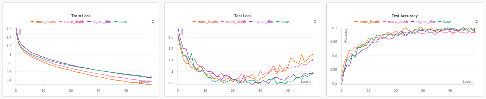
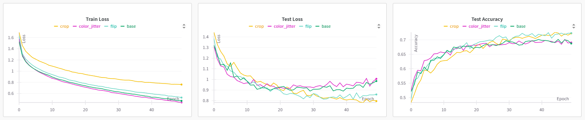
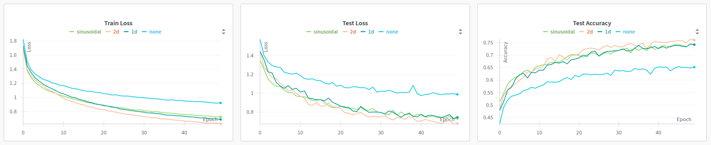
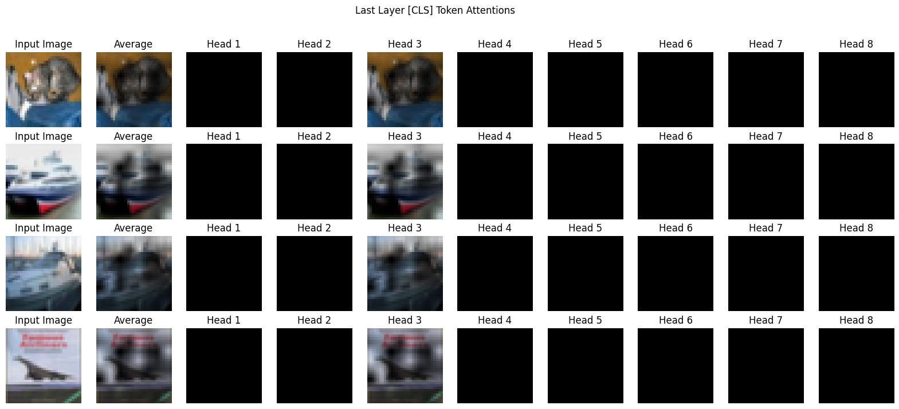
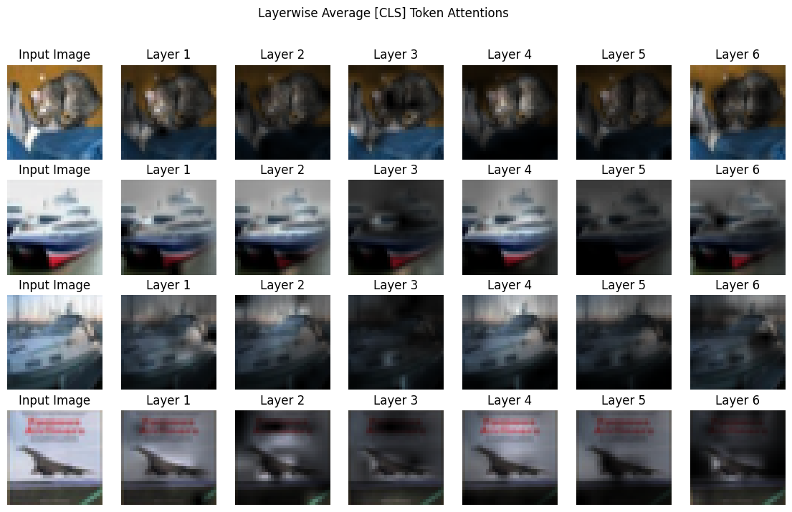
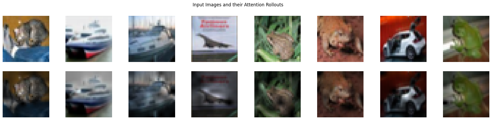

# Differential Vision Transformer

## Training

### Patch Size

Patch size of 2 worked the best, closely followed by patch size of 4. We will however use the latter for subsequent experiments, since the former can be four times slower to train.

### Hyperparameter

Unlike the vanilla vision transformer, increasing the parameters, particularly the number of encoder blocks and attention heads (coupled with dimensionality), led to improvement in training curve. Note that the divergence in test curves is due to absence of data augmentation.

### Data Augmentation

Random horizontal flip and random crop led to considerable improvement in test performance, unlike color jitter.

### Positional Embedding

All the three positional embeddings had similar results (2D slightly better than the rest), and outperformed the absence of positional embedding.

## Visualization

### ViT CIFAR-10 Attention Maps

### Attention Rollout

